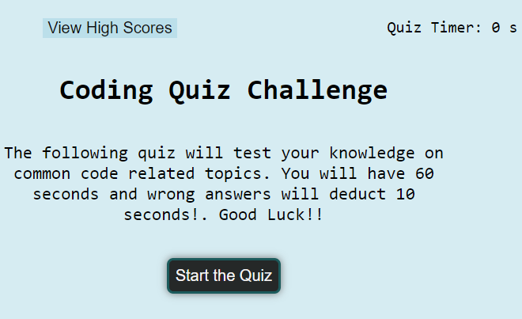

# Code Quiz

In this application, you will find a simple coding quiz. When the application is loaded, the quiz rules are displayed and a start button allows the user to start the quiz. Once the quiz starts, the timer starts counting down and the user will have 60 seconds to finish the quiz. Every wrong answer will deduct 10 seconds from the timer. Also, a simple feedback of "correct" or "wrong" is displayed when the user selects an answer. Once the quiz is done, the user can enter their initials and save their score.
At the end of the quiz, the user's scores and initials are save to local storage and displayed. A go back button allows the user to return to the main page should they want to restart the quiz again.
----
## [Link to Depolyed Application](https://momaki9.github.io/Code_Quiz/)
----
----
## [Link to Code on GitHub](https://github.com/momaki9/Code_Quiz)
----
----
## 
----
----
